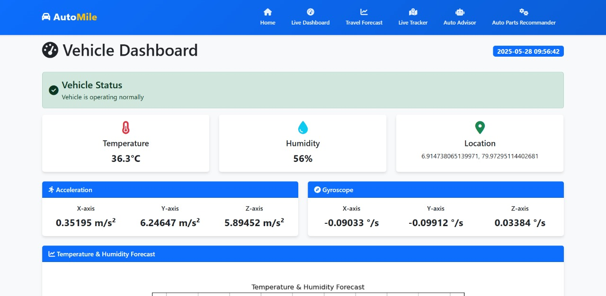

# 🚗 AutoMile – IoT-Driven Vehicle Lifecycle Optimization

AutoMile is an intelligent vehicle management system that leverages IoT, machine learning, NLP, and cloud technologies to optimize vehicle maintenance, tracking, and decision-making. Designed with a modern, responsive UI, AutoMile helps vehicle owners and fleet managers stay proactive about performance, safety, and operational costs.



---

## 🔧 Features

- **📍 Real-Time Vehicle Tracking**
  - Monitor vehicle location using ESP32 and GPS modules.
  
- **🔧 Predictive Maintenance**
  - Predict upcoming failures using sensor data and Random Forest Classifier.

- **📊 Travel Forecasting**
  - Estimate how much the vehicle is expected to travel using time-series (ARIMA) analysis.

- **🧠 AI Chatbot**
  - Ask maintenance questions or get vehicle health insights via a neural network-powered assistant.

- **🛠️ Auto Parts Recommender**
  - Get smart part suggestions using TextBlob sentiment analysis and review-based ranking.

- **📈 Dashboard Analytics**
  - Central dashboard with vehicle stats, alerts, and system insights.

---

## 🧠 Technologies Used

- **ESP32 + GPS** – Real-time vehicle tracking via IoT
- **Random Forest Classifier** – Predictive maintenance from sensor data
- **Neural Network** – AI-powered chatbot for user assistance
- **TextBlob (NLP)** – Sentiment analysis of reviews for part recommendations
- **Flask (REST API)** – Backend data flow and ML integration
- **React / Next.js** – Responsive front-end web interface
- **Cloud Platforms (AWS / GCP)** – Scalable backend processing and storage

---

## 📷 Screenshots

| Dashboard | Travel Forecast |
|-----------|-----------------|
|  |  |

| Chatbot | Part Recommender |
|--------|------------------|
|  |  |

---

## 📦 Installation

> This project includes a front-end (Next.js), back-end (Flask), and IoT module (ESP32).

```bash
# Clone the repository
git clone https://github.com/your-username/automile.git
cd automile

# Install front-end dependencies
cd client
npm install
npm run dev
